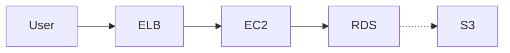

# AWS Architecture Diagram Skill

**Languages:** [日本語](README.md) | [English](README_en.md)

---

Mermaidダイアグラムやテキスト記述からAWS Architecture Diagram（インタラクティブなHTML図）を生成するスキルです。

## 🚀 クイックスタート

### ステップ 1: AWS アイコンのセットアップ

このスキルを使用する前に、AWS の公開しているアーキテクチャアイコンをダウンロードして配置する必要があります。

**AWS アーキテクチャアイコンのダウンロード：**

1. AWS 公式サイトにアクセス：[AWS Architecture Icons](http://aws.amazon.com/architecture/icons/)
2. 「Architecture icons」と「Architecture group icons」をダウンロード
3. ダウンロードしたファイルを以下のディレクトリに展開：

```
.claude/skills/aws-architecture-diagram/assets/
├── Architecture-Service-Icons_02072025/
│   ├── Arch_Analytics/
│   ├── Arch_Compute/
│   ├── Arch_Database/
│   ├── Arch_Storage/
│   ├── Arch_Security-Identity-Compliance/
│   ├── Arch_App-Integration/
│   ├── Arch_Containers/
│   ├── Arch_Developer-Tools/
│   ├── Arch_Management-Governance/
│   ├── Arch_Networking-Content-Delivery/
│   ├── Arch_Artificial-Intelligence/
│   ├── Arch_Migration-Modernization/
│   └── ... (その他のカテゴリ)
│
└── Architecture-Group-Icons_02072025/
    ├── AWS-Cloud/
    ├── Region/
    ├── Availability-Zone/
    ├── Virtual-private-cloud-VPC/
    ├── Public-subnet/
    ├── Private-subnet/
    └── ... (その他のグループアイコン)
```

**ファイル構成の例：**

各カテゴリフォルダ（例：`Arch_Compute`）内には、以下のような構造で 48px の SVG ファイルが格納されます：

```
Arch_Compute/48/
├── Arch_Amazon-EC2_48.svg
├── Arch_Amazon-EC2-Auto-Scaling_48.svg
├── Arch_Amazon-Elastic-Container-Service_48.svg
├── Arch_AWS-Lambda_48.svg
└── ... (その他のサービス)
```

### ステップ 2: スキルの使用

スキルを起動して、Mermaid または テキスト記述でアーキテクチャを定義します。

**例：**


## 📋 実装内容の詳細

### 1. アイコン埋め込み方式

**従来の方式（❌ DEPRECATED）:**
- Base64 エンコードされたデータ URI
- ファイルサイズ増加
- 視覚的損失

**現在の方式（✅ 採用）:**
- SVG コンテンツを直接 HTML に埋め込み
- フルビジュアルフィデリティ
- スケーラブル

**実装例：**
```javascript
const AWS_ICONS = {
  'EC2': '<svg width="48" height="48" viewBox="0 0 64 64" xmlns="...">...</svg>',
  'RDS': '<svg width="48" height="48" viewBox="0 0 64 64" xmlns="...">...</svg>',
  'S3': '<svg width="48" height="48" viewBox="0 0 64 64" xmlns="...">...</svg>'
};

// アイコン登録
iconRegistry[componentId] = {
  svg: AWS_ICONS['EC2'],
  x: posX - 8,  // 左上に配置（オフセット: -8）
  y: posY - 8,
  name: 'EC2'
};
```

### 2. アイコン位置調整

**要件：**
- アイコンはコンポーネント枠線に重なるように左上配置
- スケール：2/3 サイズ（48px → 約32px）
- オフセット：`x - 8, y - 8`

**なぜこのオフセット値？**
- 48px アイコンを 2/3 にスケール → 32px
- 16px オーバーハング（左上に半分重なる）
- 8px のオフセット = 16px の半分

### 3. ドラッグ&ドロップ機能

**実装：**
```javascript
// コンポーネント位置変更時のリスナー
graph.on('change:position', function(cell) {
  if (cell.id in iconRegistry) {
    const newPos = cell.position();
    const iconElement = iconContainer.querySelector(`[data-icon="${cell.id}"]`);
    if (iconElement) {
      // ドラッグ時もアイコンの相対位置を維持
      iconElement.setAttribute('transform',
        `translate(${newPos.x - 8}, ${newPos.y - 8}) scale(0.667)`);
    }
  }
});
```

**オフセット値の統一性が重要：**
- 登録時のオフセット：`x - 8, y - 8`
- ドラッグ更新時：`newPos.x - 8, newPos.y - 8`
- **両者が異なるとアイコンがドラッグ時に離れていく**（重大バグ）

### 4. ズーム・パン同期機能

**問題：**
- ズーム/パン時にアイコンが固定されて見える

**解決：**
```javascript
// アイコンコンテナ用の transform 更新関数
function updateIconsTransform() {
  const iconContainer = paper.svg.querySelector('[data-icons-container]');
  if (!iconContainer) return;

  const scale = paper.scale();
  const translate = paper.translate();

  // Paper の現在のズーム・パン状態を反映
  const transform = `translate(${translate.tx}, ${translate.ty}) scale(${scale.sx}, ${scale.sy})`;
  iconContainer.setAttribute('transform', transform);
}

// ズーム・パンイベント時に実行
paper.on('scale', updateIconsTransform);
paper.on('translate', updateIconsTransform);
```

### 5. グループのリサイズ機能

**実装：**
```javascript
// グループ ID の追跡
const groupIds = [];

// グループ作成時
const awsCloud = createGroup('aws-cloud', 'AWS Cloud', 50, 50, 1400, 900);
elements.push(awsCloud);
groupIds.push(awsCloud.id);  // ID を登録

// リサイズハンドラーの設定
paper.svg.addEventListener('mousedown', function(evt) {
  // グループの右下隅 30x30px をリサイズハンドルとして検出
  for (let i = 0; i < groupIds.length; i++) {
    const groupCell = graph.getCell(groupIds[i]);
    const pos = groupCell.position();
    const size = groupCell.size();

    // 座標変換（ズーム・パン対応）
    const scale = paper.scale().sx;
    const translate = paper.translate();
    const canvasX = (evt.clientX - svgBBox.left - translate.tx) / scale;
    const canvasY = (evt.clientY - svgBBox.top - translate.ty) / scale;

    // リサイズハンドル内かチェック
    const handleSize = 30;
    if (canvasX >= pos.x + size.width - handleSize &&
        canvasY >= pos.y + size.height - handleSize) {
      // リサイズ開始
      isResizing = true;
      resizingGroup = groupCell;
    }
  }
}, true);
```

**カーソル表示：**
```javascript
// リサイズハンドル上ではカーソルを変更
paper.svg.addEventListener('mousemove', function(evt) {
  for (let i = 0; i < groupIds.length; i++) {
    const groupCell = graph.getCell(groupIds[i]);
    // ... 座標計算 ...

    if (isInHandle) {
      paper.svg.style.cursor = 'nwse-resize';  // ↙↗
    } else if (isInGroup) {
      paper.svg.style.cursor = 'grab';
    }
  }
});
```

## 🔧 トラブルシューティング

### アイコンがドラッグ時に離れていく

**原因：** 登録時と更新時のオフセット値が異なっている

**解決：**
```javascript
// ❌ 間違い
iconRegistry[id] = { x: posX + 8, y: posY + 8, ... };
// ドラッグ時
iconElement.setAttribute('transform', `translate(${newPos.x - 8}, ...)`);

// ✅ 正しい
iconRegistry[id] = { x: posX - 8, y: posY - 8, ... };
// ドラッグ時
iconElement.setAttribute('transform', `translate(${newPos.x - 8}, ...)`);
```

### アイコンが表示されない

**原因：** `addIconsToPaper()` が実行される前にアイコンコンテナが見つからない

**解決：**
```javascript
// 遅延実行で paper のレンダリングを待つ
setTimeout(() => {
  addIconsToPaper();
  updateIconsTransform();
}, 100);
```

### ズーム・パン時にアイコンが固定される

**原因：** `updateIconsTransform()` が実行されていない

**解決：**
```javascript
// イベントリスナーの登録を確認
paper.on('scale', updateIconsTransform);
paper.on('translate', updateIconsTransform);
```

## 📊 アーキテクチャ仕様

### コンポーネント配置オフセット

| 要素 | 登録時 | ドラッグ更新時 | 説明 |
|------|-------|--------------|------|
| アイコン | `x - 8, y - 8` | `newPos.x - 8, newPos.y - 8` | 左上配置、枠線に重なる |
| アイコンスケール | 0.667 (2/3) | 0.667 (2/3) | 48px → 32px |
| グループハンドル | - | 30x30px | 右下隅のリサイズ領域 |

### AWS サービスカテゴリと色

| カテゴリ | HEX カラー | RGB |
|---------|-----------|-----|
| Compute | #ED7100 | Smile (Orange) |
| Database | #E7157B | Cosmos (Pink) |
| Analytics | #01A88D | Orbit (Teal) |
| Storage | #7AA116 | Endor (Green) |
| Security | #DD344C | Mars (Red) |
| Integration | #C925D1 | Nebula (Purple) |
| Management | #8C4FFF | Galaxy (Purple-Blue) |
| Networking | #8C4FFF | Galaxy (Purple-Blue) |
| External | #232F3E | Squid (Navy) |

## 📚 ファイル構成

```
.claude/skills/aws-architecture-diagram/
├── README.md                           # このファイル
├── SKILL.md                            # スキル詳細ドキュメント
├── REFERENCE.md                        # 技術リファレンス
│
├── templates/
│   └── diagram-template.html          # JointJS ベーステンプレート
│
├── assets/
│   ├── Architecture-Service-Icons_02072025/    # AWS サービスアイコン
│   │   ├── Arch_Analytics/
│   │   ├── Arch_Compute/
│   │   ├── Arch_Database/
│   │   └── ... (詳細は上記のセットアップセクション参照)
│   │
│   └── Architecture-Group-Icons_02072025/      # AWS グループアイコン
│       ├── AWS-Cloud/
│       ├── Region/
│       └── ... (詳細は上記のセットアップセクション参照)
│
└── (生成されたダイアグラム HTML ファイル)
```

## 🎯 スキル実行フロー

1. **入力受け取り** → Mermaid / テキスト記述
2. **解析** → AWS サービス、グループ、接続関係を識別
3. **レイアウト設計** → カテゴリに基づいてコンポーネントを配置
4. **HTML 生成** → テンプレートを使用して JointJS ベースの HTML を生成
   - アイコン登録（`iconRegistry`）
   - グループ作成（`groupIds` に登録）
   - 接続線（矢印）作成
   - イベントハンドラー設定
5. **ファイル出力** → `aws-architecture-[日付].html`

## 🔍 デバッグモード

生成された HTML ファイルで、ブラウザの開発者ツール（F12）を開いてコンソールを確認：

```javascript
// アイコン登録状態
console.log('Icon Registry:', iconRegistry);

// グループ登録状態
console.log('Group IDs:', groupIds);

// ドラッグ時のログ
console.log('Updating icon position:', cellId, newPos.x, newPos.y);
```

## 🚀 実装済み機能リスト

- ✅ アイコン埋め込み（SVG 直接）
- ✅ ドラッグ&ドロップ（完全な座標追従）
- ✅ ズーム・パン同期
- ✅ グループのリサイズ
- ✅ カーソルフィードバック（grab / nwse-resize）
- ✅ アイコン位置調整（左上、枠線に重なる）
- ✅ アイコンスケール（2/3 サイズ）
- ✅ L 字型矢印（orthogonal routing）
- ✅ グリッド背景
- ✅ レスポンシブデザイン
- ✅ キーボードショートカット（Ctrl + +/−/0）
- ✅ SVG ダウンロード機能

## 📝 変更履歴

### 2025-11-15

**追加:**
- グループコンテナのリサイズ機能
- アイコン位置の左上配置（`x - 8, y - 8`）
- ドラッグ時のアイコン完全追従
- ズーム・パン時のアイコン同期

**修正:**
- アイコンオフセット値の統一（登録時と更新時の一致）
- ドラッグ時のアイコン離脱バグ修正

**ドキュメント更新:**
- SKILL.md に新機能を記載
- REFERENCE.md にアイコンマッピング表を追加
- テンプレートに実装ガイドを追加

## 🤝 貢献ガイド

このスキルを拡張する場合は、以下の点に注意してください：

1. **アイコンオフセット値の統一**
   - 登録時：`x - 8, y - 8`
   - ドラッグ更新時：`newPos.x - 8, newPos.y - 8`
   - ズーム・パン対応：`paper.on('scale/translate')`

2. **グループ ID の登録**
   - 新しいグループを作成したら必ず `groupIds.push(groupId)`

3. **アイコン検索アルゴリズム**
   - REFERENCE.md の「Icon Lookup Algorithm」を参照
   - サービス名とファイル名のマッピングに注意

## 📖 参考資料

- [AWS Architecture Icons](http://aws.amazon.com/architecture/icons/)
- [JointJS v3 Documentation](https://docs.jointjs.com/)
- [JointJS API Reference](https://docs.jointjs.com/api/dia/Graph)
- [Tailwind CSS](https://tailwindcss.com/)

---

**最終更新：** 2025-11-15
**テンプレートバージョン：** 1.0
**スキル ステータス：** ✅ 本番環境対応
