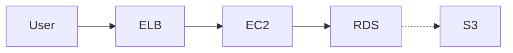

# AWS Architecture Diagram Skill

**Languages:** [English](README_en.md) | [日本語](README.md)

---

A skill that generates AWS Architecture Diagrams (interactive HTML diagrams) from Mermaid diagrams or text descriptions.

## 🚀 Quick Start

### Step 1: AWS Icons Setup

Before using this skill, you need to download and organize the AWS architecture icons published by AWS.

**Download AWS Architecture Icons:**

1. Visit AWS official site: [AWS Architecture Icons](http://aws.amazon.com/architecture/icons/)
2. Download "Architecture icons" and "Architecture group icons"
3. Extract the downloaded files to the following directory:

```
.claude/skills/aws-architecture-diagram/assets/
├── Architecture-Service-Icons_02072025/
│   ├── Arch_Analytics/
│   ├── Arch_Compute/
│   ├── Arch_Database/
│   ├── Arch_Storage/
│   ├── Arch_Security-Identity-Compliance/
│   ├── Arch_App-Integration/
│   ├── Arch_Containers/
│   ├── Arch_Developer-Tools/
│   ├── Arch_Management-Governance/
│   ├── Arch_Networking-Content-Delivery/
│   ├── Arch_Artificial-Intelligence/
│   ├── Arch_Migration-Modernization/
│   └── ... (other categories)
│
└── Architecture-Group-Icons_02072025/
    ├── AWS-Cloud/
    ├── Region/
    ├── Availability-Zone/
    ├── Virtual-private-cloud-VPC/
    ├── Public-subnet/
    ├── Private-subnet/
    └── ... (other group icons)
```

**Example File Structure:**

Each category folder (e.g., `Arch_Compute`) contains 48px SVG files with the following structure:

```
Arch_Compute/48/
├── Arch_Amazon-EC2_48.svg
├── Arch_Amazon-EC2-Auto-Scaling_48.svg
├── Arch_Amazon-Elastic-Container-Service_48.svg
├── Arch_AWS-Lambda_48.svg
└── ... (other services)
```

### Step 2: Using the Skill

Activate the skill and define your architecture using Mermaid or text descriptions.

**Example:**


## 📋 Implementation Details

### 1. Icon Embedding Method

**Legacy Method (❌ DEPRECATED):**
- Base64-encoded data URIs
- Increased file size
- Visual quality loss

**Current Method (✅ ADOPTED):**
- SVG content embedded directly in HTML
- Full visual fidelity
- Scalable

**Implementation Example:**
```javascript
const AWS_ICONS = {
  'EC2': '<svg width="48" height="48" viewBox="0 0 64 64" xmlns="...">...</svg>',
  'RDS': '<svg width="48" height="48" viewBox="0 0 64 64" xmlns="...">...</svg>',
  'S3': '<svg width="48" height="48" viewBox="0 0 64 64" xmlns="...">...</svg>'
};

// Icon registration
iconRegistry[componentId] = {
  svg: AWS_ICONS['EC2'],
  x: posX - 8,  // Top-left placement (offset: -8)
  y: posY - 8,
  name: 'EC2'
};
```

### 2. Icon Position Adjustment

**Requirements:**
- Icons positioned at top-left, slightly overlapping the component border
- Scale: 2/3 size (48px → ~32px)
- Offset: `x - 8, y - 8`

**Why this offset value?**
- 48px icon scaled to 2/3 = ~32px display size
- 16px overhang (50% overlap with border)
- 8px offset = half of 16px overhang

### 3. Drag & Drop Functionality

**Implementation:**
```javascript
// Listener for component position changes
graph.on('change:position', function(cell) {
  if (cell.id in iconRegistry) {
    const newPos = cell.position();
    const iconElement = iconContainer.querySelector(`[data-icon="${cell.id}"]`);
    if (iconElement) {
      // Maintain icon's relative position during drag
      iconElement.setAttribute('transform',
        `translate(${newPos.x - 8}, ${newPos.y - 8}) scale(0.667)`);
    }
  }
});
```

**Offset Value Consistency is Critical:**
- Registration offset: `x - 8, y - 8`
- Drag update offset: `newPos.x - 8, newPos.y - 8`
- **If offsets differ, icons will drift away during dragging** (critical bug)

### 4. Zoom & Pan Synchronization

**Problem:**
- Icons appear fixed during zoom/pan operations

**Solution:**
```javascript
// Transform update function for icon container
function updateIconsTransform() {
  const iconContainer = paper.svg.querySelector('[data-icons-container]');
  if (!iconContainer) return;

  const scale = paper.scale();
  const translate = paper.translate();

  // Reflect current Paper zoom/pan state
  const transform = `translate(${translate.tx}, ${translate.ty}) scale(${scale.sx}, ${scale.sy})`;
  iconContainer.setAttribute('transform', transform);
}

// Execute on zoom/pan events
paper.on('scale', updateIconsTransform);
paper.on('translate', updateIconsTransform);
```

### 5. Group Container Resizing

**Implementation:**
```javascript
// Track group IDs
const groupIds = [];

// When creating a group
const awsCloud = createGroup('aws-cloud', 'AWS Cloud', 50, 50, 1400, 900);
elements.push(awsCloud);
groupIds.push(awsCloud.id);  // Register ID

// Set up resize handler
paper.svg.addEventListener('mousedown', function(evt) {
  // Detect 30x30px resize handle at bottom-right corner
  for (let i = 0; i < groupIds.length; i++) {
    const groupCell = graph.getCell(groupIds[i]);
    const pos = groupCell.position();
    const size = groupCell.size();

    // Coordinate transformation (zoom/pan aware)
    const scale = paper.scale().sx;
    const translate = paper.translate();
    const canvasX = (evt.clientX - svgBBox.left - translate.tx) / scale;
    const canvasY = (evt.clientY - svgBBox.top - translate.ty) / scale;

    // Check if in resize handle
    const handleSize = 30;
    if (canvasX >= pos.x + size.width - handleSize &&
        canvasY >= pos.y + size.height - handleSize) {
      // Start resizing
      isResizing = true;
      resizingGroup = groupCell;
    }
  }
}, true);
```

**Cursor Feedback:**
```javascript
// Change cursor when on resize handle
paper.svg.addEventListener('mousemove', function(evt) {
  for (let i = 0; i < groupIds.length; i++) {
    const groupCell = graph.getCell(groupIds[i]);
    // ... coordinate calculation ...

    if (isInHandle) {
      paper.svg.style.cursor = 'nwse-resize';  // ↙↗
    } else if (isInGroup) {
      paper.svg.style.cursor = 'grab';
    }
  }
});
```

## 🔧 Troubleshooting

### Icons Drift Away During Dragging

**Cause:** Offset values differ between registration and drag update

**Solution:**
```javascript
// ❌ Incorrect
iconRegistry[id] = { x: posX + 8, y: posY + 8, ... };
// During drag
iconElement.setAttribute('transform', `translate(${newPos.x - 8}, ...)`);

// ✅ Correct
iconRegistry[id] = { x: posX - 8, y: posY - 8, ... };
// During drag
iconElement.setAttribute('transform', `translate(${newPos.x - 8}, ...)`);
```

### Icons Not Displaying

**Cause:** `addIconsToPaper()` executed before icon container is found

**Solution:**
```javascript
// Delayed execution to wait for Paper rendering
setTimeout(() => {
  addIconsToPaper();
  updateIconsTransform();
}, 100);
```

### Icons Fixed During Zoom/Pan

**Cause:** `updateIconsTransform()` not being executed

**Solution:**
```javascript
// Verify event listeners are registered
paper.on('scale', updateIconsTransform);
paper.on('translate', updateIconsTransform);
```

## 📊 Architecture Specifications

### Component Placement Offset

| Element | Registration | Drag Update | Description |
|---------|--------------|-------------|-------------|
| Icon | `x - 8, y - 8` | `newPos.x - 8, newPos.y - 8` | Top-left, overlaps border |
| Icon Scale | 0.667 (2/3) | 0.667 (2/3) | 48px → 32px |
| Group Handle | - | 30x30px | Bottom-right resize area |

### AWS Service Categories and Colors

| Category | HEX Color | RGB |
|----------|-----------|-----|
| Compute | #ED7100 | Smile (Orange) |
| Database | #E7157B | Cosmos (Pink) |
| Analytics | #01A88D | Orbit (Teal) |
| Storage | #7AA116 | Endor (Green) |
| Security | #DD344C | Mars (Red) |
| Integration | #C925D1 | Nebula (Purple) |
| Management | #8C4FFF | Galaxy (Purple-Blue) |
| Networking | #8C4FFF | Galaxy (Purple-Blue) |
| External | #232F3E | Squid (Navy) |

## 📚 File Structure

```
.claude/skills/aws-architecture-diagram/
├── README.md                           # Japanese documentation
├── README_en.md                        # English documentation
├── SKILL.md                            # Skill details
├── REFERENCE.md                        # Technical reference
│
├── templates/
│   └── diagram-template.html          # JointJS base template
│
├── assets/
│   ├── Architecture-Service-Icons_02072025/    # AWS service icons
│   │   ├── Arch_Analytics/
│   │   ├── Arch_Compute/
│   │   ├── Arch_Database/
│   │   └── ... (see setup section for details)
│   │
│   └── Architecture-Group-Icons_02072025/      # AWS group icons
│       ├── AWS-Cloud/
│       ├── Region/
│       └── ... (see setup section for details)
│
└── (generated diagram HTML files)
```

## 🎯 Skill Execution Flow

1. **Input Reception** → Mermaid / text description
2. **Parsing** → Identify AWS services, groups, and connections
3. **Layout Design** → Position components based on categories
4. **HTML Generation** → Generate JointJS-based HTML using template
   - Icon registration (`iconRegistry`)
   - Group creation (register in `groupIds`)
   - Connection lines (arrows) creation
   - Event handler setup
5. **File Output** → `aws-architecture-[date].html`

## 🔍 Debug Mode

In the generated HTML file, open browser developer tools (F12) and check the console:

```javascript
// Icon registry state
console.log('Icon Registry:', iconRegistry);

// Group registry state
console.log('Group IDs:', groupIds);

// Drag operation log
console.log('Updating icon position:', cellId, newPos.x, newPos.y);
```

## 🚀 Implemented Features List

- ✅ Icon embedding (direct SVG)
- ✅ Drag & drop (full coordinate following)
- ✅ Zoom/pan synchronization
- ✅ Group container resizing
- ✅ Cursor feedback (grab / nwse-resize)
- ✅ Icon position adjustment (top-left, border overlap)
- ✅ Icon scaling (2/3 size)
- ✅ L-shaped arrows (orthogonal routing)
- ✅ Grid background
- ✅ Responsive design
- ✅ Keyboard shortcuts (Ctrl + +/−/0)
- ✅ SVG download functionality

## 📝 Change History

### 2025-11-15

**Added:**
- Group container resizing functionality
- Icon top-left positioning (`x - 8, y - 8`)
- Icon full coordinate following during drag
- Icon synchronization during zoom/pan

**Fixed:**
- Icon offset value unification (registration and update match)
- Icon drift bug during dragging

**Documentation Updates:**
- Added new features to SKILL.md
- Added icon mapping table to REFERENCE.md
- Added implementation guide to template

## 🤝 Contribution Guide

When extending this skill, note the following:

1. **Icon Offset Value Unification**
   - Registration: `x - 8, y - 8`
   - Drag update: `newPos.x - 8, newPos.y - 8`
   - Zoom/pan: `paper.on('scale/translate')`

2. **Group ID Registration**
   - Always register new groups with `groupIds.push(groupId)`

3. **Icon Lookup Algorithm**
   - Refer to "Icon Lookup Algorithm" in REFERENCE.md
   - Pay attention to service name to filename mapping

## 📖 References

- [AWS Architecture Icons](http://aws.amazon.com/architecture/icons/)
- [JointJS v3 Documentation](https://docs.jointjs.com/)
- [JointJS API Reference](https://docs.jointjs.com/api/dia/Graph)
- [Tailwind CSS](https://tailwindcss.com/)

---

**Last Updated:** 2025-11-15
**Template Version:** 1.0
**Skill Status:** ✅ Production Ready
