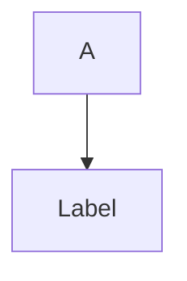

# AWS Architecture Diagram - Technical Reference

## HTML Output Structure

Generated HTML files follow this template structure:

```html
<!DOCTYPE html>
<html lang="ja">
<head>
  <meta charset="UTF-8">
  <meta name="viewport" content="width=device-width, initial-scale=1.0">
  <title>AWS Architecture Diagram</title>

  <!-- JointJS Library (CDN) -->
  <script src="https://cdn.jsdelivr.net/npm/jointjs@3/dist/joint.min.js"></script>

  <style>
    /* Tailwind CSS inline or CDN */
    /* Custom JointJS styles */
    /* Category colors */
    /* Responsive design */
  </style>
</head>
<body>
  <div id="paper"></div>

  <script>
    // JointJS initialization
    // Component definitions
    // Category grouping
    // Connection setup
    // Rendering
  </script>
</body>
</html>
```

## JointJS Implementation Details

### Category Box Structure
Categories are implemented as JointJS groups with:
- **Header**: Category name (e.g., "AWS Cloud")
- **Container**: Rectangular container with border and background
- **Nested Elements**: Service components inside category

### Service Component Layout
Each service is represented as:
- **Icon**: AWS service icon (SVG or image)
- **Label**: Service name
- **Position**: Relative to category group
- **Style**: Color-coded by service type

### Connections (Arrows)
Data flow arrows are JointJS links with:
- **Source**: Starting service
- **Target**: Destination service
- **Label**: Flow description (e.g., "Read & Write Data")
- **Routing**: Orthogonal (right-angle bends)
- **Arrow Style**: Solid or dashed based on flow type

## Color Coding by AWS Service Category

AWS officially uses a standardized color palette since Release 16 (2023.04.28) for architecture icons:

| Category | Color Name | Hex Code | RGB | Services |
|----------|------------|----------|-----|----------|
| **Compute** | Smile | `#ED7100` | rgb(237, 113, 0) | EC2, ECS, Lambda, EKS, Beanstalk, Fargate |
| **Database** | Cosmos | `#E7157B` | rgb(231, 21, 123) | RDS, DynamoDB, Aurora, ElastiCache, Neptune |
| **Analytics** | Orbit | `#01A88D` | rgb(1, 168, 141) | Redshift, Glue, Athena, EMR, Lake Formation, Kinesis |
| **Storage** | Endor | `#7AA116` | rgb(122, 161, 22) | S3, EBS, EFS, Backup, Storage Gateway |
| **Networking** | Orbit | `#01A88D` | rgb(1, 168, 141) | CloudFront, Route 53, VPC, API Gateway, Direct Connect |
| **Integration & Messaging** | Nebula | `#C925D1` | rgb(201, 37, 209) | SQS, SNS, EventBridge, AppFlow, MQ, SWF |
| **Security, Identity & Compliance** | Mars | `#DD344C` | rgb(221, 52, 76) | IAM, KMS, Secrets Manager, Firewall, Security Hub, ACM |
| **Management & Governance** | Galaxy | `#8C4FFF` | rgb(140, 79, 255) | CloudWatch, CloudFormation, Systems Manager, Config, OpsWorks |
| **Machine Learning & AI** | Smile | `#ED7100` | rgb(237, 113, 0) | SageMaker, Forecast, Personalize, Lookout, Textract |
| **Migration & Transfer** | Nebula | `#C925D1` | rgb(201, 37, 209) | DataSync, Transfer Family, Snow devices, DMS |
| **Developer Tools** | Galaxy | `#8C4FFF` | rgb(140, 79, 255) | CodeBuild, CodeDeploy, CodePipeline, CodeCommit, Cloud9 |
| **External/On-Premises** | Squid | `#232F3E` | rgb(35, 47, 62) | On-Premises, Third-party Services, User Systems |

### Color Palette Reference

The official AWS color names and hex codes (Source: AWS Release 16, 2023.04.28):

```
Smile:   #ED7100  (Orange)
Cosmos:  #E7157B  (Pink)
Orbit:   #01A88D  (Teal)
Endor:   #7AA116  (Green)
Nebula:  #C925D1  (Purple)
Mars:    #DD344C  (Red)
Galaxy:  #8C4FFF  (Purple-Blue)
Squid:   #232F3E  (Navy Blue)
```

These colors are official AWS standards for architecture diagrams and should be applied consistently across all generated diagrams.

## Icon Asset Management

### Asset File Structure
```
.claude/skills/aws-architecture-diagram/assets/
├── ec2.svg
├── rds.svg
├── s3.svg
├── redshift.svg
├── argo.svg
├── dbt.svg
├── appflow.svg
├── glue.svg
├── lake-formation.svg
├── firewall.svg
├── ekt.svg
├── kubeflow.svg
└── external-db.svg
```

### Icon Reference Method
Icons can be embedded in HTML as:

1. **Inline SVG**
   ```html
   <image href="data:image/svg+xml;base64,..."/>
   ```

2. **SVG String**
   ```javascript
   // Direct SVG path
   ```

3. **File Path** (if assets directory accessible)
   ```javascript
   const iconPath = 'assets/ec2.svg';
   ```

## Responsive Design

The diagram includes:
- **Mobile-first approach**: Works on phones, tablets, desktops
- **Auto-scaling**: Diagram scales based on screen size
- **Pan & Zoom**: Users can navigate large diagrams
- **Touch-friendly**: Touch events for mobile devices

### CSS Breakpoints
```css
/* Mobile: < 640px */
/* Tablet: 640px - 1024px */
/* Desktop: > 1024px */
```

## Interactive Features

### Hover Tooltips
Hovering over components shows:
- Service name
- Service description
- Component metadata

### Zoom & Pan
- **Scroll wheel**: Zoom in/out
- **Mouse drag**: Pan around diagram
- **Double-click**: Reset zoom

### Connection Labels
Flow arrows display:
- Data flow direction
- Operation type (Read, Write, Pull, Push)
- Optional bandwidth or latency info

## Customization Guide

### Adding Custom Service Icons
1. Create or download icon in SVG format
2. Place in `assets/` folder
3. Reference by service name in component definition

### Changing Color Scheme
Edit the `colorMap` object in the HTML:
```javascript
const colorMap = {
  'Compute': '#f97316',      // Orange
  'Database': '#a855f7',     // Purple
  'Analytics': '#14b8a6',    // Teal
  // ... more categories
};
```

### Modifying Layout
- **Component size**: Adjust `width` and `height` parameters
- **Group spacing**: Change padding in category container
- **Arrow style**: Modify `strokeWidth`, `strokeDasharray` for line style

### Adding Custom Labels
```javascript
// Arrow label example
link.label(0, {
  attrs: {
    label: {
      text: 'Read & Write Data'
    }
  }
});
```

## Data Flow Parsing

### Mermaid to JointJS Conversion
The skill parses Mermaid syntax like:


And converts to JointJS:
```javascript
const source = elements['A'];
const target = elements['B'];
const link = new joint.dia.Link({
  source,
  target,
  label: 'Label'
});
```

### Text Description Parsing
Natural language descriptions are analyzed to extract:
1. **Components**: Service names and types
2. **Relationships**: "flows to", "connects to", "reads from"
3. **Categories**: Explicit or inferred grouping
4. **Data types**: "Read Data", "Write Data", etc.

## Performance Considerations

### Large Diagrams
For diagrams with 20+ components:
- Use viewport clipping to render only visible elements
- Implement lazy loading for large icon assets
- Consider using SVG symbol references instead of inline icons

### Rendering Optimization
- JointJS uses requestAnimationFrame for smooth updates
- CSS will-change properties for animated elements
- Hardware acceleration for transforms

## Browser Compatibility

| Browser | Support | Notes |
|---------|---------|-------|
| Chrome 90+ | ✅ Full | All features supported |
| Firefox 88+ | ✅ Full | All features supported |
| Safari 14+ | ✅ Full | All features supported |
| Edge 90+ | ✅ Full | All features supported |
| IE 11 | ❌ Not supported | JointJS v3 requires modern browsers |

## File Size Optimization

Generated HTML files typically:
- Base: 50-100 KB (HTML + JointJS + CSS)
- Per 10 components: +5-10 KB
- Typical diagram: 150-300 KB

For smaller file size:
- Use SVG symbols instead of individual icons
- Minimize CSS by removing unused Tailwind classes
- Compress SVG content with SVGO

## Known Limitations

1. **Automatic Layout**: Component positions are author-defined, not auto-generated
2. **Icon Size**: Icons are scaled uniformly; custom sizing requires manual adjustment
3. **Text Wrapping**: Long labels may overflow without manual line breaks
4. **Export**: Browser print function used for PDF export (not perfect)

## Using the HTML Template

The skill includes a pre-built HTML template (`templates/diagram-template.html`) that serves as the foundation for all generated diagrams.

### Template Features

**Included Libraries:**
- JointJS v3 (via CDN)
- Tailwind CSS (via CDN)
- Modern ES6+ JavaScript

**Built-in Components:**
1. **Header**: Title and control buttons (Zoom in/out, Fit, Download)
2. **Canvas Area**: SVG-based JointJS paper for diagram rendering
3. **Footer**: Diagram information and metadata
4. **Loading State**: Spinner animation during diagram generation
5. **Color Palette**: AWS Release 16 standard colors pre-defined

**Interactive Features:**
- Zoom in/out (buttons and keyboard shortcuts: Ctrl/Cmd ±)
- Fit to view (button and Ctrl/Cmd 0)
- Download as PNG
- Pan and drag elements
- Hover tooltips (optional)
- Print-friendly CSS

### Template Customization

The `AWSDiagram` JavaScript object provides the following methods for customization:

```javascript
// Zoom operations
AWSDiagram.zoomIn()
AWSDiagram.zoomOut()
AWSDiagram.fitToView()

// Rendering
AWSDiagram.render(data)

// Helper methods
AWSDiagram.createCategoryGroup(name, x, y, width, height, color)
AWSDiagram.createServiceComponent(name, category, x, y, icon)
AWSDiagram.createConnection(sourceId, targetId, label)
```

## Working with Icon Assets

### Asset Organization

The skill includes a comprehensive AWS icon library organized into four main categories:

```
assets/
├── Architecture-Service-Icons_02072025/     # AWS service icons by category
│   ├── Arch_Analytics/                     # Analytics services
│   ├── Arch_Compute/                       # Compute services
│   ├── Arch_Database/                      # Database services
│   ├── Arch_Storage/                       # Storage services
│   ├── Arch_Security-Identity-Compliance/  # Security services
│   ├── Arch_App-Integration/               # Integration services
│   ├── Arch_Containers/                    # Container services
│   ├── Arch_Developer-Tools/               # Developer tools
│   ├── Arch_Management-Governance/         # Management services
│   ├── Arch_Networking-Content-Delivery/   # Networking services
│   ├── Arch_Artificial-Intelligence/       # AI/ML services
│   ├── Arch_Migration-Modernization/       # Migration services
│   ├── Arch_Media-Services/                # Media services
│   ├── Arch_Internet-of-Things/            # IoT services
│   ├── Arch_Blockchain/                    # Blockchain services
│   ├── Arch_Quantum-Technologies/          # Quantum services
│   ├── Arch_Robotics/                      # Robotics services
│   ├── Arch_Business-Applications/         # Business apps
│   ├── Arch_Games/                         # Gaming services
│   └── Arch_General-Icons/                 # General icons
│
├── Architecture-Group-Icons_02072025/       # Infrastructure containers
│   ├── AWS-Cloud_*.svg/png                 # AWS Cloud container
│   ├── AWS-Account_*.svg/png               # AWS Account container
│   ├── Region_*.svg/png                    # AWS Region
│   ├── Virtual-private-cloud-VPC_*.svg     # VPC container
│   ├── Public-subnet_*.svg                 # Public subnet
│   ├── Private-subnet_*.svg                # Private subnet
│   ├── Corporate-data-center_*.svg         # On-premises
│   ├── Auto-Scaling-group_*.svg            # Auto scaling group
│   └── ...                                 # Additional group icons
│
├── Resource-Icons_02072025/                # Alternative resource icons
│   ├── Res_Analytics/
│   ├── Res_Compute/
│   ├── Res_Database/
│   └── ... (organized by category)
│
└── Category-Icons_02072025/                # Category header icons
    ├── Arch-Category_16/                   # 16px icons
    ├── Arch-Category_32/                   # 32px icons
    ├── Arch-Category_48/                   # 48px icons
    └── Arch-Category_64/                   # 64px icons
```

### Available AWS Service Categories

The icon library covers all major AWS service categories:

| Category | Icon Set | Services |
|----------|----------|----------|
| **Compute** | Arch_Compute | EC2, Lambda, ECS, EKS, Fargate, Lightsail, etc. |
| **Database** | Arch_Database | RDS, DynamoDB, Aurora, Neptune, DocumentDB, etc. |
| **Analytics** | Arch_Analytics | Redshift, Glue, Athena, EMR, Kinesis, etc. |
| **Storage** | Arch_Storage | S3, EBS, EFS, Glacier, Backup, Storage Gateway |
| **Security** | Arch_Security-Identity-Compliance | IAM, KMS, Secrets Manager, Security Hub, WAF |
| **Networking** | Arch_Networking-Content-Delivery | VPC, CloudFront, Route 53, Direct Connect, ALB |
| **App Integration** | Arch_App-Integration | SQS, SNS, EventBridge, MQ, AppFlow, API Gateway |
| **Containers** | Arch_Containers | ECS, EKS, ECR, App Runner |
| **Developer Tools** | Arch_Developer-Tools | CodeBuild, CodeDeploy, CodePipeline, CodeCommit |
| **Management** | Arch_Management-Governance | CloudWatch, CloudFormation, Systems Manager |
| **AI/ML** | Arch_Artificial-Intelligence | SageMaker, Rekognition, Comprehend, Forecast |
| **Migration** | Arch_Migration-Modernization | DataSync, DMS, Server Migration Service |
| **Media** | Arch_Media-Services | Elemental MediaConvert, MediaLive, Transcoder |
| **IoT** | Arch_Internet-of-Things | IoT Core, Greengrass, Sitewise |
| **Blockchain** | Arch_Blockchain | Managed Blockchain, QLDB |
| **Games** | Arch_Games | GameLift, GameSparks |
| **Infrastructure** | Architecture-Group-Icons | Cloud, VPC, Subnets, Regions, Accounts |

### Icon Usage in Implementation

**REQUIRED: Every service component MUST display an AWS icon.**

When implementing the diagram rendering, icons should be:

1. **Read from assets directory** using relative file paths
   - Match service name to icon file in appropriate category folder
   - Example: EC2 service → `assets/Architecture-Service-Icons_02072025/Arch_Compute/EC2_48.svg`
   - Example: RDS service → `assets/Architecture-Service-Icons_02072025/Arch_Database/RDS_48.svg`

2. **Embedded as base64 in SVG** for portability and self-contained HTML output
   - Convert SVG/PNG files to base64 encoding
   - Embed directly in `<image>` or `<foreignObject>` element within SVG

3. **Positioned within component boxes**
   - Icon size: 48×48 px
   - Position: Centered horizontally, top 12px from component top edge
   - Service label text: Below icon (approximately 60px from top)

4. **Maintain accessibility**
   - Include `title` attribute with service name for hover tooltips
   - Ensure sufficient contrast between icon and background

### Icon Implementation Example (SVG)

```xml
<!-- Service component with embedded icon -->
<g id="component-ecs">
  <!-- Component box -->
  <rect x="350" y="510" width="120" height="80" fill="#ffffff" stroke="#ED7100" stroke-width="2" rx="6"/>

  <!-- Embedded AWS icon (base64-encoded) -->
  <image x="362" y="520" width="48" height="48"
    href="data:image/svg+xml;base64,PHN2ZyB3aWR0aD0iNDgiIGhlaWdodD0iNDgiIHZpZXdCb3g9IjAgMCA0OCA0OCIgeG1sbnM9Imh0dHA6Ly93d3cudzMub3JnLzIwMDAvc3ZnIj4..."/>

  <!-- Service label -->
  <text x="410" y="575" text-anchor="middle" font-size="11" font-weight="600">ECS on EC2</text>
</g>
```

### Icon Mapping Examples

| Service | Icon Path | Category Color |
|---------|-----------|-----------------|
| EC2 | Arch_Compute/EC2_48.svg | #ED7100 |
| RDS | Arch_Database/RDS_48.svg | #E7157B |
| S3 | Arch_Storage/S3_48.svg | #7AA116 |
| ElastiCache | Arch_App-Integration/ElastiCache_48.svg | #C925D1 |
| CloudFront | Arch_Networking-Content-Delivery/CloudFront_48.svg | #01A88D |
| ALB | Arch_Networking-Content-Delivery/ALB_48.svg | #01A88D |
| Route 53 | Arch_Networking-Content-Delivery/Route53_48.svg | #01A88D |
| SES | Arch_App-Integration/SES_48.svg | #C925D1 |
| SNS | Arch_App-Integration/SNS_48.svg | #C925D1 |

### Arrow/Connection Layout Strategy

To prevent arrow overlaps with components:

**1. Vertical Spacing**
- Ensure minimum 150px vertical gap between layers
- Components should be centered within allocated row space

**2. Arrow Routing (SVG Path Design) - ORTHOGONAL PREFERRED**

**Preferred: L-Shaped (Orthogonal) Connections**

L-shaped arrow (right-angle turn):
```xml
<path d="M 410 590 L 410 650 L 330 650 L 330 850"
      stroke="#6b7280" stroke-width="2"
      fill="none" marker-end="url(#arrowhead)"/>
```
- `M 410 590` - Move to ECS bottom (start point)
- `L 410 650` - Draw DOWN 60px
- `L 330 650` - Draw LEFT 80px
- `L 330 850` - Draw DOWN 200px to SNS (end point)

Multi-segment path (multiple right-angle turns):
```xml
<path d="M 470 590 L 470 620 L 600 620 L 600 750"
      stroke="#6b7280" stroke-width="2"
      fill="none" marker-end="url(#arrowhead)"/>
```
- Useful for complex routing with multiple direction changes
- Keeps flow structured and readable

**Design Strategy for Orthogonal Paths:**

1. **Vertical-Horizontal-Vertical (VHV) pattern:**
   ```
   Start (ECS bottom) → Down → Right/Left → Down → End (destination)
   M startX startY L startX+offset L endX L endX endY
   ```

2. **Horizontal-Vertical-Horizontal (HVH) pattern:**
   ```
   Start → Right/Left → Down/Up → Right/Left → End
   M startX startY L startX+offset L startX+offset endY L endX endY
   ```

3. **Spacing between paths:**
   - Minimum 15px between parallel segments
   - Use different routing channels for different connection groups
   - Example: All connections from ECS going down use y-offset 620px for horizontal segment

4. **Channel Planning Example for ECS (6 outputs):**
   ```
   ECS bottom edge at y=590

   Connection 1 (Redis): DOWN → LEFT → DOWN
   Path: M 460 590 L 460 610 L 540 610 L 540 550

   Connection 2 (RDS Primary): DOWN → RIGHT → DOWN
   Path: M 470 590 L 470 620 L 730 620 L 730 550

   Connection 3 (RDS Replica): DOWN → FAR-RIGHT → DOWN
   Path: M 480 590 L 480 630 L 920 630 L 920 550

   Connection 4 (S3): DOWN → LEFT → DOWN
   Path: M 380 590 L 380 680 L 140 680 L 140 760

   Connection 5 (SES): DOWN → LEFT-FAR → DOWN
   Path: M 370 590 L 370 750 L 140 750 L 140 850

   Connection 6 (SNS): DOWN → LEFT-MID → DOWN
   Path: M 400 590 L 400 760 L 330 760 L 330 850
   ```

**Alternative (LESS PREFERRED): Curved Paths**
Only use curves if orthogonal routing creates too many overlaps:
```xml
<path d="M 470 590 Q 500 650 600 750"
      stroke="#6b7280" stroke-width="2"
      fill="none" marker-end="url(#arrowhead)"/>
```
- `M 470 590` - Start point
- `Q 500 650 600 750` - Quadratic Bezier curve with control point at (500, 650)
- Use when horizontal-vertical paths conflict

**3. Layer Organization Best Practice**
```
Row 1: External Users (width: 600px) - y: 50-150
Row 2: CDN/DNS (width: 400px) - y: 210-310
Row 3: Load Balancer (width: 300px) - y: 360-460
Row 4: Compute/Cache/Database (width: 1000px) - y: 510-610
Row 5: Storage (width: 400px) - y: 680-760
Row 6: Integration (width: 500px) - y: 850-930
Row 7: External Services (width: 500px) - y: 1020-1100
```

**4. Critical Anti-Patterns (AVOID)**
- ❌ Straight vertical lines that pass through component boxes
- ❌ Horizontal arrows at same y-coordinate as component text
- ❌ Overlapping arrows without differentiation
- ❌ Arrow labels placed on top of other elements
- ❌ Dense clustering without sufficient padding

## HTML/CSS Layout Requirements

### Scrollable Diagram Structure

```html
<!DOCTYPE html>
<html>
<head>
  <meta charset="UTF-8">
  <meta name="viewport" content="width=device-width, initial-scale=1.0">
  <style>
    html, body {
      margin: 0;
      padding: 0;
      height: 100%;
    }

    #diagram-container {
      display: flex;
      flex-direction: column;
      height: 100%;
    }

    #diagram-header {
      flex-shrink: 0;  /* Don't shrink */
      padding: 20px;
      background-color: #ffffff;
      border-bottom: 2px solid #e5e7eb;
      /* Fixed at top */
    }

    #canvas-wrapper {
      flex: 1;  /* Take remaining space */
      overflow: auto;  /* Enable scrolling */
      background-color: #ffffff;
    }

    svg {
      display: block;
      background-color: white;
    }

    #diagram-footer {
      flex-shrink: 0;  /* Don't shrink */
      padding: 15px 20px;
      background-color: #f9fafb;
      border-top: 1px solid #e5e7eb;
      /* Fixed at bottom */
    }
  </style>
</head>
<body>
  <div id="diagram-container">
    <div id="diagram-header">
      <!-- Header content -->
    </div>
    <div id="canvas-wrapper">
      <svg id="diagram-svg">
        <!-- SVG content - scrollable -->
      </svg>
    </div>
    <div id="diagram-footer">
      <!-- Footer content -->
    </div>
  </div>
</body>
</html>
```

**Key Points:**
- `flex-direction: column` - Stacks header, content, footer vertically
- `#canvas-wrapper: flex: 1` - Takes all remaining space
- `#canvas-wrapper: overflow: auto` - Enables scrolling when content exceeds space
- `header/footer: flex-shrink: 0` - Prevents shrinking
- SVG should have explicit width/height or viewBox to enable proper scrolling

### SVG Sizing for Large Diagrams

```xml
<svg id="diagram-svg" width="2400" height="2000" xmlns="http://www.w3.org/2000/svg">
  <!-- Larger height (2000px instead of 1600px) accommodates all layers -->
</svg>
```

**Calculation:**
- Row 1 (Users): y=50-150 (100px)
- Row 2 (CDN/DNS): y=210-310 (100px)
- Row 3 (ALB): y=360-460 (100px)
- Row 4 (VPC Content): y=510-610 (100px)
- Row 5 (Storage): y=680-760 (80px)
- Row 6 (Integration): y=850-930 (80px)
- Row 7 (External): y=1020-1100 (80px)
- **Total: ~1150px + padding = 1300-1600px minimum**
- **Recommend: 2000px height for comfortable scrolling**

## Category Container Implementation

### Dashed Border Container Groups

```xml
<!-- Storage Services Group -->
<g id="group-storage">
  <rect x="50" y="665" width="450" height="140"
        fill="none" stroke="#d1d5db" stroke-width="2"
        stroke-dasharray="5,5" rx="8"/>
  <text x="70" y="685" font-size="14" font-weight="bold" fill="#374151">
    Storage Services
  </text>

  <!-- Components inside this group -->
  <rect x="80" y="700" width="120" height="80" fill="#ffffff" stroke="#7AA116" stroke-width="2" rx="6"/>
  <!-- ... -->
</g>

<!-- VPC Group (Larger, nested) -->
<g id="group-vpc">
  <rect x="20" y="470" width="1160" height="400"
        fill="none" stroke="#01A88D" stroke-width="2.5" rx="10"/>
  <text x="40" y="495" font-size="14" font-weight="bold" fill="#01A88D">
    VPC (172.31.0.0/16)
  </text>

  <!-- Sub-group: Private Subnets -->
  <g id="group-private-subnets">
    <rect x="50" y="510" width="900" height="120"
          fill="none" stroke="#9ca3af" stroke-width="1.5"
          stroke-dasharray="3,3" rx="6"/>
    <text x="70" y="530" font-size="12" font-weight="bold" fill="#6b7280">
      Private Subnets (Compute & Cache)
    </text>
    <!-- ECS, Redis components inside -->
  </g>

  <!-- Sub-group: Isolated Subnets -->
  <g id="group-database">
    <rect x="50" y="650" width="900" height="120"
          fill="none" stroke="#9ca3af" stroke-width="1.5"
          stroke-dasharray="3,3" rx="6"/>
    <text x="70" y="670" font-size="12" font-weight="bold" fill="#6b7280">
      Isolated Subnets (Database)
    </text>
    <!-- RDS components inside -->
  </g>
</g>
```

**Styling Guidelines:**
- Main group borders: 2.5px solid or dashed
- Sub-group borders: 1.5px dashed
- Group label: 14px bold, positioned 20px inside from top-left
- Padding between group border and contents: 20px minimum
- Use contrasting stroke color for main AWS boundary (teal #01A88D for VPC)

## Icon Embedding Implementation (UPDATED 2025-11-15)

### ✅ CORRECT: Direct SVG File Content Embedding

```javascript
// Recommended method: Embed SVG file content directly (NO Base64)
function embedSVGIcon(componentId, iconPath, x, y) {
  // 1. Read SVG file from assets directory
  const svgContent = readFile(iconPath);  // Returns raw SVG XML string

  // 2. Parse SVG content (optional - for validation)
  const svgParser = new DOMParser();
  const svgDoc = svgParser.parseFromString(svgContent, 'text/xml');

  // 3. Create SVG element or embed in foreignObject
  const svgElement = document.createElementNS('http://www.w3.org/2000/svg', 'svg');
  svgElement.setAttribute('x', x);
  svgElement.setAttribute('y', y);
  svgElement.setAttribute('width', '48');
  svgElement.setAttribute('height', '48');
  svgElement.setAttribute('viewBox', '0 0 64 64');

  // 4. Set SVG content directly (NO data URI needed)
  svgElement.innerHTML = svgContent;  // Direct embed

  return svgElement;
}
```

### ❌ DEPRECATED: Base64 Data URI Method

```javascript
// OLD METHOD (deprecated - do NOT use)
// Previously used Base64 encoding which caused rendering issues:
const dataUri = `data:image/svg+xml;base64,${btoa(svgContent)}`;
// Issues: Data corruption, encoding overhead, rendering inconsistencies
```

### Service Icon Mapping (Complete List - UPDATED 2025-11-15)

**CRITICAL: Filenames do NOT match service names!**

| Service Name | Actual File Name | Category Folder | Color | Notes |
|---------|---------|---|-------|-------|
| EC2 | Arch_Amazon-EC2_48.svg | Arch_Compute | #ED7100 | Common in compute |
| ECS | Arch_Amazon-Elastic-Container-Service_48.svg | Arch_Containers | #ED7100 | Not just "ECS" |
| CloudFront | Arch_Amazon-CloudFront_48.svg | Arch_Networking-Content-Delivery | #01A88D | Full "Amazon-CloudFront" |
| ALB | Arch_Elastic-Load-Balancing_Application-Load-Balancer_48.svg | Arch_Networking-Content-Delivery | #01A88D | Long hyphenated name |
| Route 53 | Arch_Amazon-Route-53_48.svg | Arch_Networking-Content-Delivery | #01A88D | Uses hyphens |
| RDS | Arch_Amazon-RDS_48.svg | Arch_Database | #E7157B | Straightforward |
| ElastiCache | Arch_Amazon-ElastiCache_48.svg | Arch_Database | #C925D1 | **IN DATABASE folder, NOT App-Integration** |
| S3 | Arch_Amazon-Simple-Storage-Service_48.svg | Arch_Storage | #7AA116 | Long full name |
| DynamoDB | Arch_Amazon-DynamoDB_48.svg | Arch_Database | #E7157B | Straightforward |
| Lambda | Arch_AWS-Lambda_48.svg | Arch_Compute | #ED7100 | Uses "AWS-" prefix |
| SNS | Arch_Amazon-Simple-Notification-Service_48.svg | Arch_App-Integration | #C925D1 | Long full name |
| SQS | Arch_Amazon-Simple-Queue-Service_48.svg | Arch_App-Integration | #C925D1 | Long full name |

**Icon Lookup Algorithm (REQUIRED):**
```python
def find_icon_file(service_name, category):
    # Step 1: Try exact match with hyphens
    patterns = [
        f"Arch_Amazon-{service_name}_48.svg",  # ECS → Amazon-ECS (if exists)
        f"Arch_AWS-{service_name}_48.svg",      # Lambda → AWS-Lambda
        f"Arch_{service_name}_48.svg",          # Generic
    ]

    # Step 2: Try known mappings
    mappings = {
        "ECS": "Elastic-Container-Service",
        "S3": "Simple-Storage-Service",
        "SNS": "Simple-Notification-Service",
        "SQS": "Simple-Queue-Service",
    }
    if service_name in mappings:
        patterns.insert(0, f"Arch_Amazon-{mappings[service_name]}_48.svg")

    # Step 3: Search in directory
    for pattern in patterns:
        if file_exists(f"./assets/Architecture-Service-Icons_02072025/{category}/48/{pattern}"):
            return pattern

    # Step 4: Search in ALL categories if not found
    for category in all_categories:
        for pattern in patterns:
            if file_exists(path):
                return path

    # Step 5: Return default if not found
    return "Arch_Default_48.svg"
```

### Adding New Icons

To add a new AWS service icon:

1. Save icon file as `assets/service-name.svg` (lowercase)
2. Ensure SVG is properly formatted (valid XML)
3. Optimize SVG using SVGO or similar tool
4. Update service mapping to include new icon reference

## Troubleshooting

### Diagram Not Rendering
- Check browser console for JavaScript errors
- Verify JointJS CDN is accessible
- Ensure SVG icons are valid XML

### Icons Not Showing
- Confirm icon files are in correct format (SVG or PNG)
- Check file paths in icon reference code
- Verify icons are properly base64-encoded in final HTML
- Test individual icon files for validity

### Layout Issues
- Adjust container dimensions in template CSS
- Modify group spacing and padding
- Check z-index stacking order in SVG element tree
- Verify text doesn't overflow component boxes

### Performance Problems
- Reduce number of components in single diagram (aim for <50)
- Use viewport clipping for large diagrams
- Optimize SVG file sizes (remove unused attributes)
- Consider lazy-loading icons for very large diagrams

## References & Resources

### JointJS Documentation

**Official Documentation:**
- **Main Docs**: https://docs.jointjs.com/
- **API Reference**: https://docs.jointjs.com/api/dia/Graph
- **Tutorials**: https://resources.jointjs.com/tutorial
- **170+ Demo Applications**: https://www.jointjs.com/all-demos

**Useful JointJS Demos:**
- [Flowchart](https://www.jointjs.com/demos/flowchart) - Basic diagram with shapes and connectors
- [Process Diagram](https://www.jointjs.com/demos/process-diagram) - Process flows similar to AWS architecture
- [Organization Chart](https://www.jointjs.com/demos/organization-chart) - Hierarchical layout
- [BPMN Editor](https://www.jointjs.com/demos/bpmn) - Complex diagram example
- [Kitchensink App](https://www.jointjs.com/demos/kitchensink) - Comprehensive feature showcase

**Framework Guides:**
- [HTML/Vanilla JS](https://www.jointjs.com/html-diagrams)
- [React](https://www.jointjs.com/react-diagrams)
- [Vue](https://www.jointjs.com/vue-diagrams)
- [Angular](https://www.jointjs.com/angular-diagrams)

**Community & Support:**
- [GitHub Repository](https://github.com/clientIO/joint) (5000+ stars)
- [Community Forum](https://www.jointjs.com/community)
- [Support Portal](https://www.jointjs.com/support)

### CSS & Styling

**Tailwind CSS:**
- [Official Documentation](https://tailwindcss.com/docs)
- [Tailwind CSS CDN](https://cdn.tailwindcss.com/) (used in template)
- [Layout Guide](https://tailwindcss.com/docs/responsive-design)
- [Colors Reference](https://tailwindcss.com/docs/customizing-colors)

**SVG & Graphics:**
- [MDN SVG Guide](https://developer.mozilla.org/en-US/docs/Web/SVG)
- [SVG Best Practices](https://www.w3.org/TR/SVG2/)

### AWS Architecture Icons & Resources

**Official AWS Icons:**
- [AWS Architecture Icons](https://aws.amazon.com/architecture/icons/)
- [AWS Icon Library](https://aws-icons.com/) (Community resource)

**AWS Architecture Best Practices:**
- [AWS Well-Architected Framework](https://aws.amazon.com/architecture/well-architected/)
- [Architecture Decision Records](https://aws.amazon.com/blogs/architecture/)

### JavaScript & Web Standards

**Modern JavaScript (ES6+):**
- [MDN JavaScript Guide](https://developer.mozilla.org/en-US/docs/Web/JavaScript/Guide)
- [ES6 Features](https://www.w3schools.com/js/js_es6.asp)

**SVG Manipulation:**
- [SVG Styling](https://developer.mozilla.org/en-US/docs/Web/SVG/Attribute)
- [Base64 Encoding](https://developer.mozilla.org/en-US/docs/Glossary/Base64)

**Browser APIs:**
- [Canvas API](https://developer.mozilla.org/en-US/docs/Web/API/Canvas_API)
- [File API](https://developer.mozilla.org/en-US/docs/Web/API/File)
- [Fetch API](https://developer.mozilla.org/en-US/docs/Web/API/Fetch_API)

### Diagram Generation Tools (Reference)

**Alternative Tools (for comparison):**
- [Mermaid.js](https://mermaid.js.org/) - Markdown-based diagrams
- [Cytoscape.js](https://cytoscape.org/) - Graph visualization library
- [D3.js](https://d3js.org/) - Data-driven visualization
- [Graphviz](https://graphviz.org/) - Graph visualization

### Implementation Tips

**When implementing the skill, refer to:**

1. **JointJS Shapes & Elements**
   - [Basic Shapes](https://docs.jointjs.com/api/dia/shapes/standard)
   - [Custom Shapes](https://docs.jointjs.com/api/dia/Element)
   - [Links & Connectors](https://docs.jointjs.com/api/dia/Link)

2. **JointJS Layout Algorithms**
   - [Hierarchical Layout](https://docs.jointjs.com/plugins/layout/Hierarchical)
   - [Force Layout](https://docs.jointjs.com/plugins/layout/Force)
   - [Grid Layout](https://docs.jointjs.com/plugins/layout/Grid)

3. **Event Handling**
   - [Paper Events](https://docs.jointjs.com/api/dia/Paper/events)
   - [Element Events](https://docs.jointjs.com/api/dia/Element/events)
   - [Link Events](https://docs.jointjs.com/api/dia/Link/events)

4. **SVG/CSS Styling in JointJS**
   - Use `attrs` property to style shapes
   - Apply CSS classes via `class` attribute
   - Reference AWS color palette (Hex codes) in style definitions

---

**Last Updated**: 2024年11月15日
**JointJS Version**: v3 (latest)
**Tailwind CSS**: v3+
**AWS Icons**: Architecture Icons 2024
