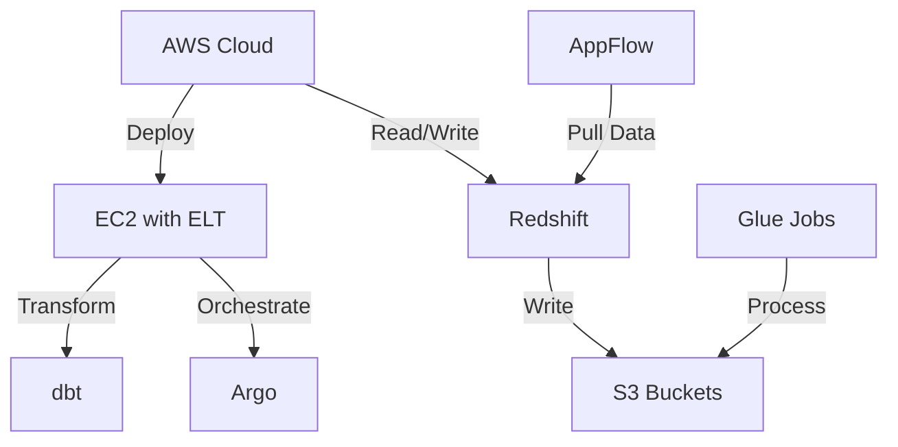

# AWS Architecture Diagram Generator

Generate beautiful, interactive AWS infrastructure architecture diagrams from text descriptions, Mermaid definitions, or other formats. Claude analyzes your architecture and creates an optimized visual layout with category-grouped components and data flow arrows.

## Instructions

### Step 1: Understand the Input
I will accept your AWS infrastructure description in any of these formats:
- **Plain text**: Narrative description of architecture
- **Mermaid diagram**: Existing Mermaid graph definition
- **JSON/YAML**: Structured component and connection definitions
- **ASCII sketch**: Hand-drawn or ASCII-formatted diagram
- **Mixed format**: Any combination of the above

### Step 2: Analyze Architecture
1. Parse and extract all infrastructure components
2. Identify AWS services and their categories (Compute, Database, Analytics, Security, etc.)
3. Understand data flow relationships and dependencies
4. Design optimal layout with grouped categories

### Step 3: Generate HTML Diagram
1. Create a standalone HTML file with embedded JointJS and CSS
2. Organize components by category (AWS Cloud, On-Premises, External Services, etc.)
3. Add connection arrows showing data flow direction
4. Apply color coding by service category
5. Include interactive features (hover tooltips, zoom)

### Step 4: Integrate Icons
- Icons should be placed in the `assets/` directory within the skill folder
- Each icon file should be referenced by service name
- Icons are embedded as SVG or image references within the diagram

### Step 5: Output
Generate a single `aws-architecture-[timestamp].html` file that:
- Runs entirely in a browser (no external dependencies)
- Includes all CSS and JavaScript inline
- Displays properly on desktop and mobile
- Is ready for sharing, printing, or embedding

## Input Formats Supported

### 1. Plain Text Description
```
We have an AWS Cloud infrastructure with:
- EC2 instances running on ELT with KubeFlow and Kubernetes
- Argo for orchestration
- dbt for data transformation
- Data flows from EC2 to Redshift
- AppFlow pulls data into S3
- Glue jobs process data
- Lake Formation manages permissions
- Firewall secures the environment
```

### 2. Mermaid Format


### 3. JSON Structure
```json
{
  "categories": [
    {
      "name": "AWS Cloud",
      "components": [
        {"name": "EC2", "type": "Compute", "color": "#ED7100"},
        {"name": "Redshift", "type": "Analytics", "color": "#01A88D"}
      ]
    }
  ],
  "connections": [
    {
      "from": "EC2",
      "to": "Redshift",
      "label": "Read & Write Data"
    }
  ]
}
```

**Note:** Colors use official AWS Release 16 (2023.04.28) standard palette:
- Compute: `#ED7100` (Smile - Orange)
- Database: `#E7157B` (Cosmos - Pink)
- Analytics: `#01A88D` (Orbit - Teal)
- Storage: `#7AA116` (Endor - Green)
- Security: `#DD344C` (Mars - Red)
- Integration: `#C925D1` (Nebula - Purple)
- Management: `#8C4FFF` (Galaxy - Purple-Blue)
- External: `#232F3E` (Squid - Navy Blue)

## Examples

### Example 1: Simple Three-Tier Architecture
**Input:**
```
GitLab CI Runner → AWS CDK (Deploy Infrastructure) →
AWS Cloud:
  - EC2 (Compute)
  - RDS (Database)
  - S3 (Storage)
External: Salesforce
```

**Output:** HTML file with three-category layout:
- GitLab CI (external)
- AWS Cloud (grouped container)
- Salesforce (external)

### Example 2: Complex Data Pipeline
**Input:**
```
Data sources (AppFlow, AWS Glue) →
AWS Cloud:
  - ELT (Kubernetes, EKS)
  - Argo (orchestration)
  - dbt (transformation)
↓
Redshift Data Warehouse
↓
S3 Data Buckets
↓
Lake Formation (governance)
↓
External Databases
```

**Output:** HTML file with swimlane layout showing:
1. Data Ingestion layer
2. Processing layer (ELT, Argo, dbt)
3. Storage layer (Redshift, S3)
4. Governance layer (Lake Formation)
5. External access points

### Example 3: Security-Focused Architecture
**Input:**
```
AWS Cloud:
  [Firewall] → [AppFlow]
           ↓
       [Redshift]
       ↙    ↓    ↘
    [S3] [Glue] [Lake Formation]

Security: AWS Firewall Manager controls all access
```

**Output:** HTML with:
- Security layer highlighted
- Color-coded access paths
- Encrypted connection indicators
- Permission boundaries

## Best Practices

1. **Be descriptive**: Include service names, relationships, and data flow direction
2. **Specify categories**: Group related services (e.g., "Compute", "Database", "Analytics")
3. **Include data labels**: Annotate arrows with "Read Data", "Write Data", "API calls", etc.
4. **Consider security**: Mention firewalls, encryption, IAM boundaries
5. **Provide context**: Explain the purpose of each service if not obvious

## Implementation Requirements

**CRITICAL HTML/Layout Structure:**
- **Scrollable Content**: SVG diagram must be in a scrollable container (flex: 1, overflow: auto)
- **Fixed Header/Footer**: Keep header and footer fixed, content area fills remaining space
- **SVG Sizing**: SVG viewBox should accommodate all content with padding (min 2400×1600 for large diagrams)
- **Viewport Meta**: Include proper responsive viewport meta tag
- **Mobile Responsive**: Diagram should be viewable on all screen sizes with scroll

**Icon Integration (MANDATORY):**
- **Every single service component MUST display an AWS icon**
- Icons source: Read from `assets/Architecture-Service-Icons_*/` and `assets/Architecture-Group-Icons_*/`
- Icon format: Convert SVG/PNG files to base64-encoded data URIs
- Embedding method: Use `<image>` element with `href="data:image/svg+xml;base64,..."`
- Icon size: 48×48 px within component boxes (120×80 px)
- Icon position: Centered horizontally, positioned 10px from top of component
- Service label: Below icon (approximately 60px from top)
- **DO NOT SKIP**: Icon selection must match service type exactly

**Category Grouping (HIERARCHY):**
- Group related services into logical categories with **visual container boxes**
- Examples:
  - "CDN & DNS" group: CloudFront + Route 53 in dashed border container
  - "VPC" group: All VPC resources in larger container (recursion allowed)
    - "Public Subnets" sub-group
    - "Private Subnets" sub-group (contains ECS, Redis)
    - "Isolated Subnets" sub-group (contains RDS Primary, Replica)
  - "Storage Services" group: S3 Primary + S3 Backup
  - "Integration & Messaging" group: SES + SNS
  - "External Services" group: OAuth, Firebase, DataRobot, Banks
- Container styling: Dashed border, padding 20px, semi-transparent background (if needed)
- Nested grouping is acceptable for VPC-like structures

**Layout & Design:**
- Organize services in clear horizontal or vertical layers/swimlanes
- **CRITICAL**: Ensure arrows do NOT overlap with component boxes, labels, or other arrows
  - Use curved paths (SVG Bezier curves) for arrows that span multiple levels
  - Adjust arrow curvature and control points to avoid intersections
  - Leave sufficient vertical/horizontal spacing between layers (minimum 150px)
- Position arrows outside component bounds with appropriate curve control
- Each service should have clear space around it (padding minimum 15px)
- Avoid clustering too many components in a single layer
- For complex flows (one source → 6+ destinations): Fan out arrows at different angles

**Arrow Design (PREFERRED: Orthogonal/Right-angle paths):**
- **PRIORITY: Use L-shaped and orthogonal (right-angle) paths** instead of curves
  - More structured and clear visual flow
  - Easier to read and trace data paths
  - Prevents tangling with other arrows
- Arrow style hierarchy (in order of preference):
  1. **L-shaped paths** (orthogonal, right-angle bends) - PRIMARY CHOICE
  2. **Multi-segment paths** (multiple right-angle turns) - EXCELLENT CHOICE
  3. **Straight lines** (for simple adjacent connections) - ACCEPTABLE
  4. **Curved paths** (Bezier curves Q/C commands) - USE ONLY if orthogonal paths would overlap
- Arrow endpoints should clearly point to destination components (not pass through)
- Label complex arrows with data flow descriptions when applicable
- Use different line styles (solid, dashed, dotted) to distinguish flow types:
  - Solid: Primary data flow
  - Dashed: User/external connections
  - Dotted: Optional/backup flows
- Arrow width: 2px standard, 3px for critical paths

**Component Organization:**
- Group related components by functional area (Compute, Database, Storage, etc.)
- Use visual grouping (distinct regions or containers) to show relationships
- Maintain consistent component sizing (120×80 px baseline, adjustable for labels)
- Reserve enough space for all connections without overlaps
- Component labels: Service name on first line, optional subtitle on second line
- Text sizing: Main label 12px bold, subtitle 10px regular

## Skill Resources

This skill includes templates and assets for diagram generation.

### HTML Template

A pre-built HTML template with JointJS and CSS is included:
```
.claude/skills/aws-architecture-diagram/templates/diagram-template.html
```

The template includes:
- JointJS v3 library (CDN)
- Tailwind CSS for styling
- AWS standard color palette
- Interactive controls (zoom, pan, download)
- Responsive design for all devices
- Print-friendly styles

### Icon Assets

The skill includes a comprehensive AWS icon library with multiple icon sets:

**Asset Location:**
```
.claude/skills/aws-architecture-diagram/assets/
```

**Available Icon Sets:**

1. **Architecture Service Icons** (`Architecture-Service-Icons_02072025/`)
   - Full AWS service icons organized by category
   - Categories include:
     - Compute, Database, Analytics, Storage
     - Security, Identity & Compliance
     - App Integration, Management & Governance
     - Developer Tools, Containers, Networking
     - AI/ML, Migration, Media Services
     - IoT, Blockchain, Quantum, Robotics
     - And more...
   - Format: SVG and PNG (32px, 48px, 64px variants)

2. **Architecture Group Icons** (`Architecture-Group-Icons_02072025/`)
   - Container and infrastructure icons:
     - AWS Cloud, AWS Account, Region, VPC
     - Public/Private Subnets
     - Auto-Scaling Groups, Spot Fleet
     - On-Premises, Data Centers
   - Format: SVG and PNG

3. **Resource Icons** (`Resource-Icons_02072025/`)
   - Alternative resource icon set
   - Organized by service category
   - Compatible with Architecture Service Icons

4. **Category Icons** (`Category-Icons_02072025/`)
   - Category header icons for swimlane grouping
   - All AWS service categories represented
   - Multiple sizes (16px, 32px, 48px, 64px)

**Icon Usage in Diagrams:**

Icons are referenced by service name and automatically:
- Located in the asset directory
- Embedded as base64 in the final HTML
- Scaled proportionally within component boxes
- Positioned above service labels

**Example Icon Paths:**
```
assets/Architecture-Service-Icons_02072025/Arch_Compute/EC2_32.svg
assets/Architecture-Service-Icons_02072025/Arch_Database/RDS_32.svg
assets/Architecture-Service-Icons_02072025/Arch_Analytics/Redshift_32.svg
assets/Architecture-Group-Icons_02072025/AWS-Cloud_32.svg
assets/Category-Icons_02072025/Arch-Category_32/Arch-Category_Analytics_32.svg
```

### File Structure

```
.claude/skills/aws-architecture-diagram/
│
├── SKILL.md                          # Main documentation (this file)
├── REFERENCE.md                      # Technical reference & implementation guide
│
├── templates/
│   └── diagram-template.html         # Pre-built HTML template with JointJS, CSS, JS
│
└── assets/
    ├── Architecture-Service-Icons_02072025/     # AWS service icons by category
    │   ├── Arch_Analytics/           # Analytics services (Redshift, Glue, etc.)
    │   ├── Arch_Compute/             # Compute services (EC2, Lambda, ECS, etc.)
    │   ├── Arch_Database/            # Database services (RDS, DynamoDB, etc.)
    │   ├── Arch_Storage/             # Storage services (S3, EBS, EFS, etc.)
    │   ├── Arch_Security-Identity-Compliance/   # Security services
    │   ├── Arch_App-Integration/     # Integration services (SQS, SNS, etc.)
    │   ├── Arch_Containers/          # Container services (ECS, EKS, ECR)
    │   ├── Arch_Developer-Tools/     # Developer tools
    │   ├── Arch_Management-Governance/          # Management services
    │   ├── Arch_Networking-Content-Delivery/    # Networking
    │   ├── Arch_Artificial-Intelligence/        # AI/ML services
    │   ├── Arch_Migration-Modernization/        # Migration services
    │   └── ... (20+ more categories)
    │
    ├── Architecture-Group-Icons_02072025/       # Infrastructure containers
    │   ├── AWS-Cloud_*.svg/png      # AWS Cloud container
    │   ├── AWS-Account_*.svg        # AWS Account
    │   ├── Region_*.svg             # AWS Region
    │   ├── Virtual-private-cloud-VPC_*.svg     # VPC
    │   ├── Public-subnet_*.svg      # Public subnet
    │   ├── Private-subnet_*.svg     # Private subnet
    │   └── ... (more group icons)
    │
    ├── Resource-Icons_02072025/                 # Alternative icon set
    │   └── (organized by category)
    │
    └── Category-Icons_02072025/                 # Category headers
        ├── Arch-Category_16/        # 16px category icons
        ├── Arch-Category_32/        # 32px category icons
        ├── Arch-Category_48/        # 48px category icons
        └── Arch-Category_64/        # 64px category icons
```

**Icon Count:** 700+ SVG/PNG icons across all AWS service categories
**Icon Formats:** SVG (scalable) and PNG (multiple sizes: 32px, 48px, 64px)
**Coverage:** All major AWS services and infrastructure components

## Implementation Requirements (CRITICAL)

### ⚠️ ICON FILE LOOKUP IS REQUIRED
**Filenames do NOT match service names!** The skill MUST implement proper icon lookup:

- **Service "ECS"** → File: `Arch_Amazon-Elastic-Container-Service_48.svg` (NOT `Arch_ECS_48.svg`)
- **Service "S3"** → File: `Arch_Amazon-Simple-Storage-Service_48.svg` (NOT `Arch_S3_48.svg`)
- **Service "ElastiCache"** → File: `Arch_Amazon-ElastiCache_48.svg` in **Arch_Database** folder (NOT App-Integration)
- **Service "RDS"** → File: `Arch_Amazon-RDS_48.svg`

**Required Algorithm:**
1. Maintain icon name mapping: `{ "ECS": "Elastic-Container-Service", "S3": "Simple-Storage-Service", ... }`
2. Search assets directory using multiple patterns
3. If not found in expected category, search ALL categories
4. Fall back to default icon if not found
5. Log warnings for missing icons

See `REFERENCE.md` → "Icon Lookup Algorithm" for implementation details.

## Recent Modifications (2025-11-15)

### ✅ SVG Icon Embedding (CRITICAL UPDATE)
All AWS service icons are now **embedded directly as SVG content** from the assets directory:
- **Previous (❌ DEPRECATED)**: Base64-encoded icon data URIs
- **Current (✅ CORRECT)**: Direct SVG file content embedded in HTML
- **Location**: `./assets/Architecture-Service-Icons_02072025/[Category]/48/Arch_[Service]_48.svg`
- **Benefit**: Full visual fidelity, no data corruption from encoding

### ✅ Icon Transform with Zoom/Pan (UPDATED)
Icons now properly respond to zoom and pan operations:
- **Current Implementation**: Icons added to dedicated SVG root container (not scene group)
- **Mechanism**:
  - Icons registered in `iconRegistry` during component creation with (x-8, y-8) offset
  - `addIconsToPaper()` creates `[data-icons-container]` at SVG root level
  - `updateIconsTransform()` function syncs icon container with paper's zoom/pan state
  - Event handlers: `paper.on('scale', updateIconsTransform)` and `paper.on('translate', updateIconsTransform)`
  - Icons are transformed independently from JointJS cells to prevent double-transformation issues
  - **Result**: Icons stay perfectly aligned with components during zoom/pan operations

### ✅ Drag & Drop with Icon Synchronization (NEW)
Components can be dragged and icons follow smoothly:
- **Feature**: Full drag & drop interactivity enabled via `interactive: true` in Paper config
- **Icon Sync Mechanism**:
  - `graph.on('change:position')` listener detects component position changes
  - Individual icon transforms updated with new component coordinates
  - Icon offset maintained: `translate(${newPos.x - 8}, ${newPos.y - 8}) scale(0.667)`
- **Result**: Icons stay perfectly aligned with dragged components in real-time

### ✅ Link Label Padding (NEW FIX)
Arrow labels now have proper padding and visibility:
- **Previous (❌ BUG)**: Text squeezed in tiny boxes, hard to read
- **Current (✅ FIXED)**: labelBBox padding configuration
- **Implementation**:
  ```javascript
  labelBBox: { left: -35, top: -10, right: 35, bottom: 10 }
  ```
- **Result**: Minimum 70px width, 20px height ensures text is readable

### ✅ Grid Background Added
Canvas background now includes a subtle grid pattern:
- **Grid Color**: Light gray (#e5e7eb)
- **Background Color**: Off-white (#f9fafb)
- **Style**: Mesh pattern at 10px intervals
- **Visual Effect**: Professional grid helps with alignment and spatial relationships

### ✅ JointJS Library Dependencies
Fixed loading order for JointJS v3:
- Added required dependencies: jQuery, Lodash, Backbone
- Changed CDN source to cdnjs for reliability
- Implemented proper library loading check with timeout retry

### ✅ Embedding Order Fixed (JointJS)
Corrected parent-child embedding hierarchy:
- **Correct**: `parent.embed(child)`
- **Wrong**: `child.embed(parent)` ← caused "Embedding of already embedded cells" error

### ✅ Group Container Resizing (NEW FEATURE)
Group containers (dashed border rectangles) can now be resized interactively:
- **Feature**: Drag bottom-right corner of any group to resize it
- **Cursor Feedback**:
  - `nwse-resize` (↙↗) when hovering over resize handle
  - `grab` when hovering over group interior
  - `default` when not over any group
- **Implementation**:
  - Create `groupIds` array to track all group container IDs
  - Add group ID to array when creating each group: `groupIds.push(groupId)`
  - Implement mousedown/mousemove handlers on paper.svg with coordinate transformation
  - Call `groupCell.resize(width, height)` to update group size
- **Constraints**: Minimum width 200px, minimum height 150px
- **Usage**: Users can resize groups to fit their layout needs dynamically

## Customization Options

You can request adjustments:
- **Layout**: Change component positions or grouping
- **Colors**: Override default color scheme
- **Labels**: Add descriptions to connections
- **Zoom/Pan**: Enable/disable interactive features
- **Size**: Adjust diagram dimensions
- **Background**: Grid pattern, color, or plain white
- **Icons**: SVG or PNG formats (automatically embedded)

## Output Files

All generated diagrams are:
- Standalone HTML files (no external dependencies)
- Browser-compatible (Chrome, Firefox, Safari, Edge)
- Print-friendly with CSS media queries
- Ready for embedding in documentation

## Library Documentation & References

This skill uses several libraries for diagram generation. For implementation details, refer to the official documentation:

### Core Libraries

**JointJS v3 - Diagram Library**
- Official Documentation: https://docs.jointjs.com/
- API Reference: https://docs.jointjs.com/api/dia/Graph
- Tutorial: https://resources.jointjs.com/tutorial
- GitHub: https://github.com/clientIO/joint
- Key Resources:
  - [Basic Shapes](https://docs.jointjs.com/api/dia/shapes/standard)
  - [Links & Connectors](https://docs.jointjs.com/api/dia/Link)
  - [Event Handling](https://docs.jointjs.com/api/dia/Paper/events)
  - [170+ Demo Applications](https://www.jointjs.com/all-demos)

**Tailwind CSS v3 - Styling Framework**
- Official Documentation: https://tailwindcss.com/docs
- CDN: https://cdn.tailwindcss.com/
- Colors Reference: https://tailwindcss.com/docs/customizing-colors
- Responsive Design: https://tailwindcss.com/docs/responsive-design

### AWS Architecture Resources

**AWS Icons & Architecture:**
- AWS Architecture Icons: https://aws.amazon.com/architecture/icons/
- AWS Well-Architected Framework: https://aws.amazon.com/architecture/well-architected/
- AWS Icons Community: https://aws-icons.com/

### JavaScript & Web Standards

**SVG & Graphics:**
- MDN SVG Guide: https://developer.mozilla.org/en-US/docs/Web/SVG
- SVG Best Practices: https://www.w3.org/TR/SVG2/

**JavaScript:**
- MDN JavaScript Guide: https://developer.mozilla.org/en-US/docs/Web/JavaScript/Guide
- ES6+ Features: https://www.w3schools.com/js/js_es6.asp
- Base64 Encoding: https://developer.mozilla.org/en-US/docs/Glossary/Base64

## Useful Examples from JointJS Demos

When implementing this skill, the following JointJS demos are particularly relevant:

1. **Flowchart** (https://www.jointjs.com/demos/flowchart)
   - Basic shapes and connectors
   - Similar to AWS service component layout

2. **Process Diagram** (https://www.jointjs.com/demos/process-diagram)
   - Data flow visualization
   - Groups and swimlanes (AWS categories)

3. **Organization Chart** (https://www.jointjs.com/demos/organization-chart)
   - Hierarchical layout
   - Useful for understanding component relationships

4. **Kitchensink App** (https://www.jointjs.com/demos/kitchensink)
   - Comprehensive feature showcase
   - Interactive element manipulation

---

For implementation details and technical reference, see [REFERENCE.md](REFERENCE.md).
